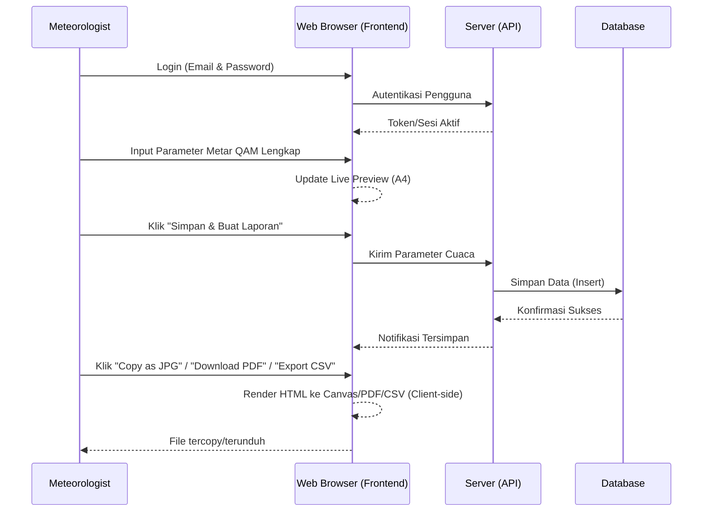
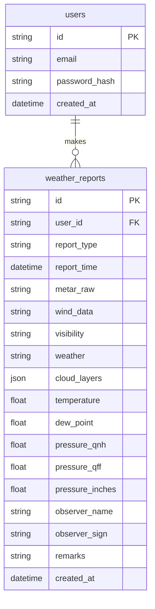

# PRD — Project Requirements Document

## 1. Overview
Dalam operasional penerbangan, pelaporan cuaca yang cepat, akurat, dan sesuai standar sangatlah krusial. Saat ini, pembuatan laporan cuaca penerbangan (Metar QAM) mungkin masih membutuhkan proses manual yang tidak terintegrasi antara pengisian data, pemformatan dokumen akhir, dan penyimpanan arsip sejarah cuaca. 

Aplikasi ini bertujuan untuk menyediakan platform web khusus bagi ahli meteorologi (Meteorologist) untuk menginput parameter cuaca secara lengkap dan terstruktur ke dalam sebuah formulir secara *real-time*. Hasil input tersebut akan otomatis terformat menjadi dokumen seukuran A4 yang bisa langsung disalin (copy) ke clipboard dalam format gambar (JPG), diunduh sebagai PDF, atau diekspor sebagai data mentah (CSV). Selain itu, setiap laporan yang dibuat akan disimpan secara permanen ke dalam basis data untuk keperluan arsip dan rekam jejak yang komprehensif.

## 2. Requirements
- **Target Pengguna:** Meteorologist (Ahli Meteorologi).
- **Platform:** Aplikasi Web (diakses melalui Web Browser, dioptimalkan untuk tampilan desktop agar memudahkan preview ukuran A4).
- **Autentikasi Pengguna:** Menggunakan Email dan Password.
- **Sistem Data:** Hanya *Online*, data cuaca diinput secara manual oleh pengguna.
- **Penyimpanan Data:** Seluruh data parameter cuaca dan riwayat pelaporan disimpan selamanya (*forever retention*).
- **Keluaran Laporan (Output):** 
  - Visual dokumen berukuran kertas A4.
  - Fitur *Copy to Clipboard* dengan hasil output berformat JPG.
  - Fitur simpan/unduh dokumen dalam format PDF.
  - Fitur ekspor data parameter dalam format CSV untuk analisis lebih lanjut.

## 3. Core Features
- **Sistem Autentikasi:** Fitur login aman bagi ahli meteorologi.
- **Formulir Input Cuaca (Metar QAM) Lengkap:** Form interaktif untuk memasukkan parameter cuaca secara detail, meliputi:
  - **Jenis Laporan:** Pilihan antara MET REPORT atau SPECIAL.
  - **Angin:** Arah dan kecepatan angin.
  - **Jarak Pandang (Visibility).**
  - **Cuaca Saat Ini (Present Weather).**
  - **Perawanan (Clouds):** Input untuk Banyaknya (Amount), Jenis (Type), dan Tinggi Dasar Awan (Height) (mendukung multiple layers).
  - **Suhu & Titik Embun:** Suhu udara (Celcius) dan dew point.
  - **Tekanan Udara:** Input QNH dan QFF, dengan konversi otomatis ke satuan Inci (Inches Hg).
  - **Otorisasi:** Nama Pengamat dan Tanda Tangan (Sign).
- ***Live Preview* A4:** Tampilan seketika (*real-time*) di sebelah form yang menunjukkan bagaimana laporan akhir akan terlihat dalam dokumen berukuran A4 seiring dengan data yang diinputkan pengguna.
- **Manajemen Ekspor Dokumen:** Tombol aksi sekali klik untuk:
  - "Salin sebagai JPG" (menyalin visual A4 langsung ke *clipboard* perangkat).
  - "Unduh PDF" (menyimpan dokumen resmi).
  - "Ekspor CSV" (menyimpan data parameter dalam format tabel CSV).
- **Arsip Laporan Otomatis:** Setiap kali pengguna menekan tombol "Simpan & Buat Laporan", seluruh parameter data yang diinput dicatat ke dalam database lengkap dengan informasi waktu pelaporan dan identitas pengamat.

## 4. User Flow
1. **Login:** Meteorologist membuka aplikasi di web browser dan login menggunakan Email dan Password.
2. **Halaman Dasbor/Form:** Pengguna diarahkan ke halaman utama yang menampilkan Formulir Input di satu sisi dan *Preview* Kertas A4 kosong di sisi lainnya.
3. **Input Data:** Pengguna memilih jenis laporan (MET/SPECIAL) dan mengetikkan data cuaca lengkap (termasuk QNH, QFF, Awan, dll) ke dalam form. Di saat yang sama, data di *Preview* A4 langsung terisi menyesuaikan inputan.
4. **Penyimpanan Data:** Setelah data dipastikan benar, pengguna mengklik tombol **"Simpan & Buat Laporan"**. Aplikasi menyimpan data tersebut ke *database*.
5. **Ekspor/Distribusi:** 
   - Pengguna mengklik tombol **"Copy as JPG"** untuk menyalin gambar laporan A4 dan menempelkannya (*paste*) langsung ke aplikasi pesan.
   - Atau, pengguna mengklik **"Download PDF"** untuk menyimpan dokumen resmi.
   - Atau, pengguna mengklik **"Export CSV"** untuk mengunduh data parameter mentah guna keperluan analisis atau backup lokal.

## 5. Architecture
Aplikasi ini menggunakan arsitektur *Client-Server* sederhana berbasis web. Pemrosesan visual (seperti pembuatan gambar JPG, dokumen PDF, dan file CSV) akan dilakukan secara dominan di sisi *Client* (browser) menggunakan pustaka khusus demi kecepatan dan pengalaman *real-time*. Sementara itu, *Backend* bertugas menangani autentikasi dan menyimpan data parameter ke *Database*.

## 6. Database Schema
Sistem membutuhkan dua tabel utama: tabel `users` untuk menyimpan data akun meteorologist dan tabel `weather_reports` untuk menyimpan semua riwayat data cuaca yang dilaporkan dengan parameter yang diperbarui.

### Tabel: `users`
| Kolom / Field | Tipe Data | Kegunaan |
|-------------|-----------|----------|
| `id` | String (UUID/CUID) | Identifier unik (Primary Key) pengguna |
| `email` | String | Email pengguna untuk login |
| `password_hash`| String | Kata sandi yang sudah dienkripsi |
| `created_at` | DateTime | Waktu saat akun dibuat |

### Tabel: `weather_reports`
| Kolom / Field | Tipe Data | Kegunaan |
|-------------|-----------|----------|
| `id` | String (UUID/CUID) | Identifier unik (Primary Key) laporan |
| `user_id` | String | Relasi ke tabel pengguna (siapa yang membuat) |
| `report_type` | String | Jenis laporan (MET REPORT / SPECIAL) |
| `report_time` | DateTime | Waktu pengamatan/laporan cuaca |
| `metar_raw` | String | Keseluruhan teks sandi (jika diperlukan) |
| `wind_data` | String | Menyimpan arah dan kecepatan angin |
| `visibility` | String | Jarak pandang |
| `weather` | String | Fenomena cuaca saat itu (Present Weather) |
| `cloud_layers` | JSON/Text | Data perawanan (Banyaknya, Jenis, Tinggi) |
| `temperature` | Float | Suhu udara (Celcius) |
| `dew_point` | Float | Suhu titik embun (Celcius) |
| `pressure_qnh`| Float | Tekanan udara QNH (hPa) |
| `pressure_qff`| Float | Tekanan udara QFF (hPa) |
| `pressure_inches`| Float | Tekanan udara konversi (Inci Hg) |
| `observer_name`| String | Nama lengkap pengamat |
| `observer_sign`| String | Tanda tangan pengamat (Nama/Hash/Path) |
| `remarks` | String | Catatan tambahan |
| `created_at` | DateTime | Waktu riil saat laporan disimpan ke sistem |

## 7. Tech Stack
Berdasarkan kebutuhan untuk pengembangan yang cepat, modern, dan handal, berikut adalah rekomendasi teknologi yang akan digunakan:

- **Frontend & Backend Framework:** **Next.js** (App Router) - Memudahkan pembuatan antarmuka web dan API sekaligus.
- **Styling & UI Components:** **Tailwind CSS** dan **shadcn/ui** - Memastikan tampilan form yang rapi, profesional, dan struktur kertas A4 yang proporsional.
- **Database & ORM:** 
  - **SQLite** - Database ringan yang sangat mumpuni untuk pencatatan berbasis teks.
  - **Drizzle ORM** - Untuk memanipulasi dan berinteraksi dengan database SQLite.
- **Authentication:** **Better Auth** - Implementasi login email/password yang terintegrasi mudah dengan ekosistem Next.js.
- **Ekspor Dokumen (Client-Side Libraries):**
  - **html2canvas** / **dom-to-image:** Untuk menangkap elemen div berukuran A4 HTML menjadi file gambar (JPG) sehingga dapat ditulis ke Clipboard OS.
  - **jspdf** atau **@react-pdf/renderer:** Untuk mengkonversi tampilan ke dalam bentuk file PDF yang standar dan rapi.
  - **papaparse** atau **Blob CSV:** Untuk men-generate file CSV dari data parameter laporan secara cepat di sisi klien.
- **Deployment:** **Vercel** (untuk kemudahan hosting Next.js) atau layanan *cloud computing* sederhana. Platform database bisa menggunakan **Turso** (jika memakai sistem SQLite terdistribusi/online).